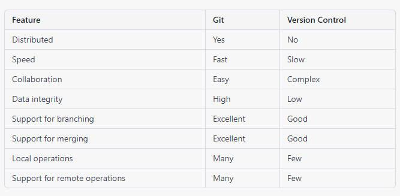

# What is GIT ? 

By far, the most widely used modern version control system in the world today is Git. Git is a mature, actively maintained open source project originally developed in 2005 by Linus Torvalds, the famous creator of the Linux operating system kernel. A staggering number of software projects rely on Git for version control, including commercial projects as well as open source. Developers who have worked with Git are well represented in the pool of available software development talent and it works well on a wide range of operating systems and IDEs (Integrated Development Environments).

Having a distributed architecture, Git is an example of a DVCS (hence Distributed Version Control System). Rather than have only one single place for the full version history of the software as is common in once-popular version control systems like CVS or Subversion (also known as SVN), in Git, every developer's working copy of the code is also a repository that can contain the full history of all changes.

In addition to being distributed, Git has been designed with performance, security and flexibility in mind.

### For more information 

https://www.atlassian.com/git/tutorials/what-is-git 

## What is Version Control? 

Version control, also known as source control, is the practice of tracking and managing changes to software code. Version control systems are software tools that help software teams manage changes to source code over time. As development environments have accelerated, version control systems help software teams work faster and smarter. They are especially useful for DevOps teams since they help them to reduce development time and increase successful deployments.

Version control software keeps track of every modification to the code in a special kind of database. If a mistake is made, developers can turn back the clock and compare earlier versions of the code to help fix the mistake while minimizing disruption to all team members.

### For more information

https://www.youtube.com/watch?v=Yc8sCSeMhi4 

### Note: 
This table is a simplified generalization and some version control systems may have similar features as git.

### SETUP : Configuring user information used across all local repositories

    git config --global user.name “[firstname lastname]”

set a name that is identifiable for credit when review version history

    git config --global user.email “[valid-email]”

set an email address that will be associated with each history marker

### INIT : Initializing and cloning repositories

    git init

initialize an existing directory as a Git repository

    git clone [URL]

retrieve an entire repository from a hosted location via URL

### STAGE & SNAPSHOT : Working with snapshots and the Git staging area

    git status

show modified files in working directory, staged for your next commit

    git add [file]

add a file as it looks now to your next commit (stage)

    git reset [file]

unstage a file while retaining the changes in working directory

    git diff 

diff of what is changed but not staged

    git diff --staged

diff of what is staged but not yet committed

    git commit -m “[descriptive message]” 

commit your staged content as a new commit snapshot

## BRANCH & MERGE : Isolating work in branches, changing context, and integrating changes
    
    git branch

list your branches. a * will appear next to the currently active branch

    git branch [branch-name]

a new branch at the current commit

    git checkout

switch to another branch and check it out into your working directory

    git merge [branch]

merge the specified branch’s history into the current one

    git log 

show all commits in the current branch’s history

## SHARE & UPDATE: Retrieving updates from another repository and updating local repos
    
    git remote add [alias] [url] 

add a git URL as an alias

    git fetch [alias] 

fetch down all the branches from that Git remote

    git merge [alias]/[branch]

merge a remote branch into your current branch to bring it up to date

    git push [alias] [branch]

Transmit local branch commits to the remote repository branch

    git pull
fetch and merge any commits from the tracking remote branch

#### For More information

https://docs.google.com/document/d/1gYZaQxDa3o419xD1vJLaIyA7y99BfyfzEo5rAA_LSzg/edit 

https://www.atlassian.com/git/tutorials/atlassian-git-cheatsheet 

https://education.github.com/git-cheat-sheet-education.pdf 

https://docs.google.com/document/d/1DvUN4vy5CSA3gszM9VGDH0eqRSsuSpQ05I6L6tkUXiE 