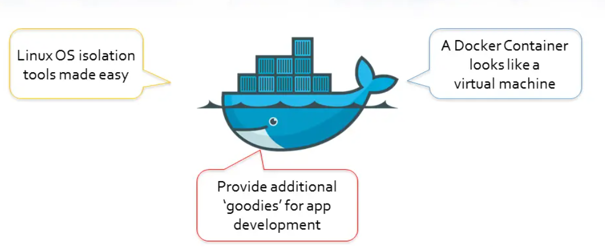
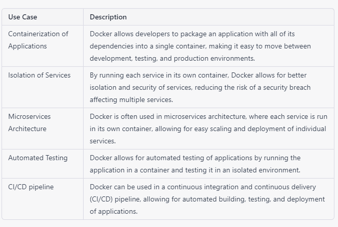
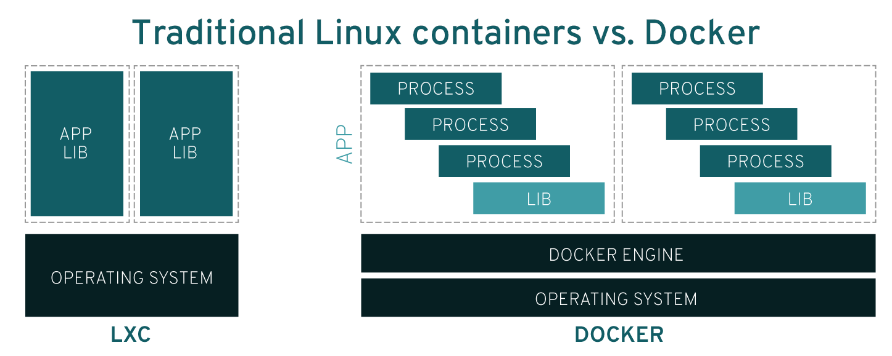

# Docker 
Docker is a platform that allows developers to easily deploy, run, and manage applications in a containerized environment. Containers are a lightweight alternative to virtual machines, and they allow developers to package an application with all of its dependencies and run it consistently across different environments. Docker provides a platform-agnostic way to create and manage containers, making it easy to deploy applications on a wide range of systems, including Windows, Mac, and Linux.

## What is Docker container ?
Containers are the ready applications created from Docker Images or you can say a Docker Container is a running instance of a Docker Image and they hold the entire package needed to run the application. This happens to be the ultimate utility of Docker.

## Why you should use Docker and containers ?

Now, let’s get started with several major advantages of using Docker:

1. Consistent & Isolated Environment
The very first advantage of Docker is that it provides you with a consistent and isolated environment. It takes the responsibility of isolating and segregating your apps and resources in such a way that each container becomes able to access all the required resources in an isolated manner i.e., without disturbing or depending on another container. It eventually allows you to run multiple containers simultaneously on the same host. Moreover, as each container is only allowed to access the assigned resources – it helps in reducing the risk of several potential issues such as downtime, etc. Also, you can easily remove any app by deleting its container, and it will not leave behind any temporary files, etc. on your system.

In simple words, what the consistent environment here means is that the Docker image created by you during any development stage will work similarly in other SDLC phases also such as testing, production, etc.  

2. Rapid Application Deployment
Docker indeed fastens the application deployment process to a greater extent. It efficiently organizes the entire development lifecycle by providing a standardized working environment to the developers. You need to know that Docker creates a container for every individual process and subsequently the Docker apps do not boot into an OS – that saves a lot of time. The docker containers come up with the minimal runtime requirements of the application that allows them to deploy faster. Here, you’re not required to set up a new environment – all you need to do is download the Docker image to run it on different environments. And let us tell you these images are quite smaller in size that further prompts rapid application deployment. Docker is very preferable for Continuous Integration and Continuous Delivery (CI/CD) workflows.  

3. Ensures Scalability & Flexibility
Docker leverages you with the utmost level of scalability and flexibility. Due to the consistent environment – the Docker images can be easily sorted across multiple servers. For instance, if you’re required to do an upgrade during the release of the application – you can conveniently do the changes in Docker containers, can test them & roll out new containers. Other than that, you can efficiently clean up or repair the application without completely taking it down. It has the ability to be deployed in multiple physical servers, data servers, or cloud platforms. Also, Docker allows you to rapidly create replications for redundancy reasons, and it makes you enable to start and terminate the application or services promptly to make things much easier.

4. Better Portability
Another enriching advantage of Docker is Portability! The applications created with Docker containers are immensely portable. The Docker containers can run on any platform whether it be Amazon EC2, Google Cloud Platform, VirtualBox, Rackspace server, or any other – though the host OS should support Docker. As the application and all its dependencies are packaged together in a Docker container – you can deploy it to any system that supports Docker and the application will perform similarly. For instance, the Docker containers can swiftly move from the cloud environment to localhost and vice-versa. It subsequently results in various benefits such as no wastage of time & resources in setting up environments, debugging issues in environments, etc. It really helps the developers to make the development process more responsive and agile.

5. Cost-Effective
Needless to say, every tech organization wants to opt for such development and deployment practices or resources that can help them to reduce overall cost without compromising with the standard workflow or product quality. And Docker can help them to achieve this feat! As Docker reduces the need for more infrastructure resources for development and the container created for individual processes can be shared with other apps with instances of these containerized apps using less memory compared to virtual machines – it makes the development and deployment process more cost-effective. With Docker, developers can run multiple containers on a single server that results in the efficient use of resources. Meanwhile, Docker subsequently requires a smaller team of professionals compared to the traditional workflow that also leads to minimized workforce costs for the organization.

6. In-Built Version Control System  
Going down with the list, let us tell you another prominent advantage of Docker – it comes up with an in-built version control system. The Docker containers allow you to commit changes to the Docker images and version control them conveniently. For instance – if you are having some issues with the current or upgraded version of the image – you can quickly roll back to a previous stable version of the Docker image. Docker enables you to easily track successive versions of a container and inspect the differences before rolling back to the previous versions. In addition, the containers can maintain all configurations and dependencies internally and the components from the previous layers can be reused by the containers for better efficiency.

7. Security
Lastly, here comes the Security advantage! From a general outlook, an application in a container can be considered as more secure by default compared to the case with bare metal. As Docker takes the responsibility of complete isolation and segregation of applications running within the Docker containers with each other – the developers have complete control over the traffic course. A particular container cannot access the data of another container without having authorized access. Other than that, each container is assigned a particular set of resources for itself. However, you need to remember – you can’t be solely dependent on Docker containers for taking all the appropriate security measures on itself instead you will be required to consider other security areas as well for overall security.  

Out of the numerous ones, these are some of the major benefits of using Docker. You can get an idea of the huge popularity and demand of Docker in the tech world from the fact that almost every IT giant such as Microsoft, Amazon, Google, etc. is currently supporting Docker on their respective cloud platform. As the technology is still very much young and trending – you all are strongly recommended to at least explore the technology by reading the above-mentioned advantages to staying updated in the tech world…!!